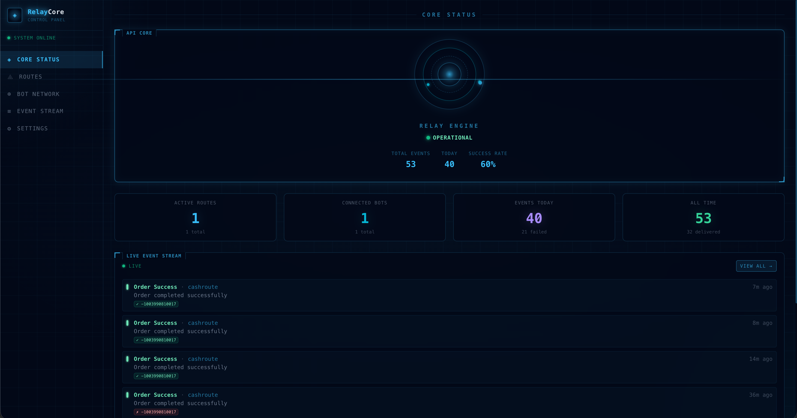

# RelayCore

**Personal serverless event relay control panel for Vercel.**

Send events from your apps → receive them as Telegram messages. One API endpoint, multiple bots, multiple chats — all configured through a futuristic web dashboard.



---

## What is this?

RelayCore is a self-hosted notification relay you deploy to Vercel. Your apps POST HTTP events to it, and it forwards them to Telegram bots/chats you configure.

**Use cases:**
- Server error alerts → Telegram
- Deploy notifications → team chat
- Payment events → finance channel
- Cron job status → personal bot
- Any app event → any Telegram destination

```
Your App  →  POST /api/r/my-route  →  RelayCore  →  Telegram Bot  →  Your Chat
```

---

## Features

- **One-click Vercel deploy** — no server to manage
- **Multiple bots** — connect as many Telegram bots as you need
- **Multiple targets per route** — one event → many chats simultaneously
- **Forum group support** — send to specific topics in Telegram forum groups
- **Live event log** — see all events and delivery statuses in real time
- **API key management** — reveal, regenerate per-route keys
- **Futuristic HUD dashboard** — dark sci-fi control panel UI
- **Setup wizard** — guided first-run configuration

---

## Tech Stack

- [Next.js 16](https://nextjs.org) — App Router, TypeScript, serverless functions
- [Upstash Redis / Vercel KV](https://upstash.com) — all data storage
- [Telegram Bot API](https://core.telegram.org/bots/api) — message delivery
- [Framer Motion](https://www.framer.com/motion/) — animations
- [TailwindCSS v4](https://tailwindcss.com) — styling

---

## Deploy to Vercel

### Step 1 — Fork & Deploy

[](https://vercel.com/new/clone?repository-url=https://github.com/hiddenway/relay-core)

Or manually:
1. Fork this repository
2. Go to [vercel.com/new](https://vercel.com/new) and import your fork

### Step 2 — Connect Redis Storage

In your Vercel project dashboard:

```
Storage → Create Database → KV (Upstash Redis)
```

This automatically adds `KV_REST_API_URL` and `KV_REST_API_TOKEN` to your environment.

> **Alternative:** Connect Upstash Redis directly — it adds `UPSTASH_REDIS_REST_URL` and `UPSTASH_REDIS_REST_TOKEN`. Both are supported.

### Step 3 — Add Environment Variables

In **Settings → Environment Variables**, add:

| Variable | Description | Example |
|----------|-------------|---------|
| `APP_SECRET` | Encryption key for tokens and sessions. Generate with `openssl rand -hex 32` | `a3f8...` |
| `SETUP_PASSWORD` | One-time password to access the setup wizard | `mysecretsetup` |

### Step 4 — Redeploy

After adding variables, trigger a redeployment:
```
Deployments → ⋯ → Redeploy
```

### Step 5 — Complete Setup Wizard

Open your app URL — you'll be guided through:
1. Enter your `SETUP_PASSWORD`
2. Create admin username/password
3. Connect your first Telegram bot
4. Create your first route
5. Send a test event
6. Enter the dashboard

---

## Environment Variables Reference

| Variable | Required | Source | Description |
|----------|----------|--------|-------------|
| `KV_REST_API_URL` | ✅ | Vercel KV | Redis REST URL |
| `KV_REST_API_TOKEN` | ✅ | Vercel KV | Redis REST token |
| `UPSTASH_REDIS_REST_URL` | ✅* | Upstash | Alternative to KV vars |
| `UPSTASH_REDIS_REST_TOKEN` | ✅* | Upstash | Alternative to KV vars |
| `APP_SECRET` | ✅ | Manual | 32+ char random string |
| `SETUP_PASSWORD` | ✅ | Manual | Setup wizard password |

\*Either KV or Upstash vars required, not both.

Generate `APP_SECRET`:
```bash
openssl rand -hex 32
```

---

## API Reference

### Send Event

```
POST /api/r/{slug}
```

**Headers:**
```
x-api-key: rck_your_api_key
Content-Type: application/json
```

---

### Event Parameters

All fields are optional. You can send any combination — even an empty body `{}` is valid.

#### `title` — string, max 256 chars

The headline of the message. Shown in **bold** in Telegram.  
If omitted, the route name is used as the title.

```json
{ "title": "Payment received" }
```

---

#### `message` — string, max 4096 chars

The body text of the message. Rendered by Telegram with **HTML formatting** — tags are interpreted, not escaped.  
Supports multi-line strings via `\n`.

**Supported HTML tags:**

| Tag | Result |
|-----|--------|
| `<b>text</b>` | **bold** |
| `<i>text</i>` | _italic_ |
| `<u>text</u>` | underline |
| `<s>text</s>` | ~~strikethrough~~ |
| `<code>text</code>` | `inline code` |
| `<pre>text</pre>` | code block |
| `<pre><code class="language-python">...</code></pre>` | syntax-highlighted code block |
| `<a href="https://...">text</a>` | hyperlink |
| `<tg-spoiler>text</tg-spoiler>` | hidden spoiler text |

```json
{
  "message": "Deploy <b>v2.1.0</b> to <code>production</code> — <a href=\"https://github.com/org/repo/releases\">view release</a>"
}
```

```json
{
  "message": "Exception in worker:\n<pre><code class=\"language-python\">KeyError: 'user_id'\n  at line 42</code></pre>"
}
```

> **Note:** `title` and `payload` are always HTML-escaped automatically. Only `message` renders HTML tags.

---

#### `level` — string enum

Controls the emoji prefix and visual indicator of the event.

| Value | Emoji | Use case |
|-------|-------|----------|
| `info` | ℹ️ | Default. General information |
| `success` | ✅ | Operation completed successfully |
| `warning` | ⚠️ | Something needs attention |
| `error` | ❌ | Something failed |

```json
{ "level": "error" }
```

Defaults to `info` if omitted.

---

#### `payload` — object or string

Additional structured data shown as a formatted code block in Telegram.  
Accepts either a **JSON object** or a **JSON string** (useful for event streaming tools like Amplitude).

**As object:**
```json
{
  "payload": {
    "user_id": "u_123",
    "plan": "pro",
    "amount": 49.99,
    "currency": "USD"
  }
}
```

**As string (e.g. from Amplitude streaming constructor):**
```json
{
  "payload": "{\"user_id\":\"u_123\",\"plan\":\"pro\"}"
}
```

Both render identically in Telegram as a `<pre>` code block.

---

### Full Request Example

```json
{
  "title": "New subscription",
  "message": "User upgraded to Pro plan",
  "level": "success",
  "payload": {
    "user_id": "u_456",
    "plan": "pro",
    "amount": 99.99,
    "currency": "USD",
    "source": "stripe"
  }
}
```

**Resulting Telegram message:**
```
✅ [SUCCESS] New subscription
Route: my-payments
Time:  2024-06-01 14:32:10 UTC

User upgraded to Pro plan

{
  "user_id": "u_456",
  "plan": "pro",
  "amount": 99.99,
  "currency": "USD",
  "source": "stripe"
}
```

---

### Minimal Request

You don't need all fields. Even a single field works:

```bash
# just a title
curl -X POST -H "x-api-key: rck_..." -H "Content-Type: application/json" \
  -d '{"title":"Server restarted"}' \
  https://your-app.vercel.app/api/r/my-route

# just a level (sends route name as title)
curl -X POST -H "x-api-key: rck_..." -H "Content-Type: application/json" \
  -d '{"level":"error","message":"Database connection timeout"}' \
  https://your-app.vercel.app/api/r/my-route
```

---

### Response

```json
{
  "id": "uuid",
  "timestamp": "2024-01-01T00:00:00.000Z",
  "delivered": 2,
  "failed": 0,
  "deliveries": [
    {
      "botId": "abc123",
      "chatId": "-1001234567890",
      "success": true,
      "messageId": 42
    }
  ]
}
```

| Field | Description |
|-------|-------------|
| `id` | Unique event ID |
| `timestamp` | ISO 8601 delivery time |
| `delivered` | Number of targets that received the message |
| `failed` | Number of targets that failed |
| `deliveries` | Per-target delivery result array |
| `deliveries[].success` | Whether delivery succeeded |
| `deliveries[].messageId` | Telegram message ID (on success) |
| `deliveries[].error` | Error description (on failure) |

---

### Status Codes

| Code | Meaning |
|------|---------|
| `200` | Event delivered |
| `400` | Invalid request body |
| `401` | Missing or invalid `x-api-key` |
| `403` | Route is disabled |
| `404` | Route not found |
| `429` | Rate limit exceeded (60 req/min per route) |

---

## Usage Examples

### cURL

```bash
curl -X POST \
  -H "x-api-key: rck_your_api_key" \
  -H "Content-Type: application/json" \
  -d '{
    "title": "Payment received",
    "level": "success",
    "payload": { "amount": 99.99, "currency": "USD" }
  }' \
  https://your-app.vercel.app/api/r/payments
```

### JavaScript / TypeScript

```ts
await fetch("https://your-app.vercel.app/api/r/payments", {
  method: "POST",
  headers: {
    "x-api-key": process.env.RELAY_API_KEY!,
    "Content-Type": "application/json",
  },
  body: JSON.stringify({
    title: "New order",
    level: "info",
    message: "Order #1234 placed by user@example.com",
    payload: { orderId: 1234, total: 49.99 },
  }),
});
```

### Python

```python
import requests

requests.post(
    "https://your-app.vercel.app/api/r/payments",
    headers={
        "x-api-key": "rck_your_api_key",
        "Content-Type": "application/json",
    },
    json={
        "title": "Server error",
        "level": "error",
        "message": "Unhandled exception in worker",
        "payload": {"exception": "NullPointerException", "line": 42},
    },
)
```

### Go

```go
body := `{"title":"Deploy done","level":"success"}`
req, _ := http.NewRequest("POST", "https://your-app.vercel.app/api/r/deploys", strings.NewReader(body))
req.Header.Set("x-api-key", "rck_your_api_key")
req.Header.Set("Content-Type", "application/json")
http.DefaultClient.Do(req)
```

---

## Telegram Setup

### Create a Bot

1. Open Telegram → search **@BotFather**
2. Send `/newbot` and follow prompts
3. Copy the HTTP API token (format: `123456789:ABCdef...`)
4. Add the bot to your chat/channel and make it an admin

### Get Chat ID

**Personal chat or group:**
1. Add **@userinfobot** to the chat
2. Send any message — it replies with the chat ID

**Channel:**
- Format: `-100XXXXXXXXXX`
- Forward a message from the channel to @userinfobot

### Forum Groups (Topics)

Telegram forum groups have topics, each with a Thread ID.

From the topic URL `https://t.me/c/3990810017/2`:
- **Chat ID:** `-1003990810017` (add `-100` prefix to the number)
- **Thread ID:** `2` (the last number in the URL)

When creating a route target, fill in both Chat ID and Thread ID to send messages to that specific topic.

---

## Dashboard Pages

| Page | Description |
|------|-------------|
| `/dashboard` | Core status, stats, live event stream |
| `/routes` | All routes — enable/disable/delete |
| `/routes/new` | Create route with multiple targets |
| `/routes/[slug]` | Route details, API key, endpoint docs, recent logs |
| `/bots` | Manage connected Telegram bots |
| `/bots/new` | Add new bot |
| `/logs` | Full event log with filters and payload viewer |
| `/settings` | Environment reference, Redis data model docs |

---

## Security Model

| What | How |
|------|-----|
| Telegram bot tokens | AES-256-GCM encrypted with `APP_SECRET` |
| Admin password | bcrypt, cost factor 12 |
| Route API keys | AES-256-GCM encrypted — revealable in dashboard |
| Panel sessions | HS256 JWT in `httpOnly` secure cookie, 7-day expiry |
| Dashboard routes | Protected by Next.js proxy middleware |
| Setup endpoint | Permanently disabled after first completion |
| Rate limiting | 60 req/min per route (in-memory, resets on cold start) |

API keys are **never exposed** in list API responses — only accessible via the explicit Reveal button on the route detail page.

---

## Redis Data Model

| Key | Type | Description |
|-----|------|-------------|
| `app:setup_completed` | boolean | Setup done flag |
| `app:admin` | JSON | Admin username + password hash |
| `bots:index` | JSON array | List of bot IDs |
| `bot:{id}` | JSON | Bot name, encrypted token, enabled state |
| `routes:index` | JSON array | List of route slugs |
| `route:{slug}` | JSON | Route config, targets, encrypted API key |
| `events:recent` | List | Last 100 global events |
| `events:route:{slug}` | List | Last 50 events per route |
| `stats:total` | Hash | All-time `total` / `success` / `failed` |
| `stats:today:{YYYY-MM-DD}` | Hash | Daily stats (7-day TTL) |
| `stats:route:{slug}` | Hash | Per-route stats |

---

## Local Development

```bash
# Clone
git clone https://github.com/hiddenway/relay-core.git
cd relay-core

# Install dependencies
npm install

# Copy and fill environment variables
cp .env.example .env.local
```

Edit `.env.local`:
```env
KV_REST_API_URL=https://your-kv.kv.vercel-storage.com
KV_REST_API_TOKEN=your-token
APP_SECRET=your-random-32-char-secret
SETUP_PASSWORD=your-setup-password
```

```bash
# Start dev server
npm run dev
```

Open [http://localhost:3000](http://localhost:3000).

Get free Redis at [upstash.com](https://upstash.com) for local development.

---

## Project Structure

```
relay-core/
├── app/
│   ├── api/
│   │   ├── r/[slug]/              # Main relay endpoint (POST)
│   │   ├── auth/login/            # Login
│   │   ├── auth/logout/           # Logout
│   │   ├── setup/                 # Setup wizard + token verify
│   │   ├── bots/                  # Bot list + create
│   │   ├── bots/[botId]/          # Bot update + delete
│   │   ├── routes/                # Route list + create
│   │   ├── routes/[slug]/         # Route get + update + delete
│   │   ├── routes/[slug]/reveal-key/     # Decrypt and return API key
│   │   ├── routes/[slug]/regenerate-key/ # Generate new API key
│   │   ├── logs/                  # Event log query
│   │   ├── stats/                 # Dashboard stats
│   │   └── test-event/            # Send test event from dashboard
│   ├── dashboard/                 # Dashboard home page
│   ├── routes/                    # Routes pages
│   ├── bots/                      # Bots pages
│   ├── logs/                      # Logs page
│   ├── settings/                  # Settings page
│   ├── setup/                     # Setup wizard page
│   ├── login/                     # Login page
│   ├── layout.tsx                 # Root layout
│   └── page.tsx                   # Root — checks Redis, redirects
├── components/
│   ├── hud/
│   │   ├── GridBackground.tsx     # Animated grid backdrop
│   │   ├── HolographicRings.tsx   # Spinning orbital rings
│   │   ├── HudCard.tsx            # Glass card with HUD corners
│   │   └── StatusBadge.tsx        # Animated status dot
│   ├── DashboardLayout.tsx        # Sidebar navigation + layout
│   ├── DashboardHome.tsx          # Core status + live stream
│   ├── RoutesPanel.tsx            # Route list
│   ├── RouteDetail.tsx            # Route detail + docs
│   ├── NewRouteForm.tsx           # Route creation form
│   ├── BotsPanel.tsx              # Bot list
│   ├── NewBotForm.tsx             # Bot creation form
│   ├── LogsPanel.tsx              # Event log viewer
│   ├── SettingsPanel.tsx          # Settings reference
│   ├── SetupWizard.tsx            # Multi-step setup
│   ├── LoginForm.tsx              # Login form
│   └── StorageCoreOffline.tsx     # No-Redis screen
├── lib/
│   ├── redis.ts                   # All Redis read/write operations
│   ├── crypto.ts                  # AES encryption, bcrypt, key generation
│   ├── auth.ts                    # JWT sessions, cookies
│   ├── telegram.ts                # Telegram API client + formatter
│   └── utils.ts                   # cn(), slugify(), timeAgo()...
├── types/
│   └── index.ts                   # TypeScript interfaces
├── proxy.ts                       # Auth middleware (Next.js 16)
├── vercel.json                    # Vercel deploy config
└── .env.example                   # Environment variables template
```

---

## License

MIT
